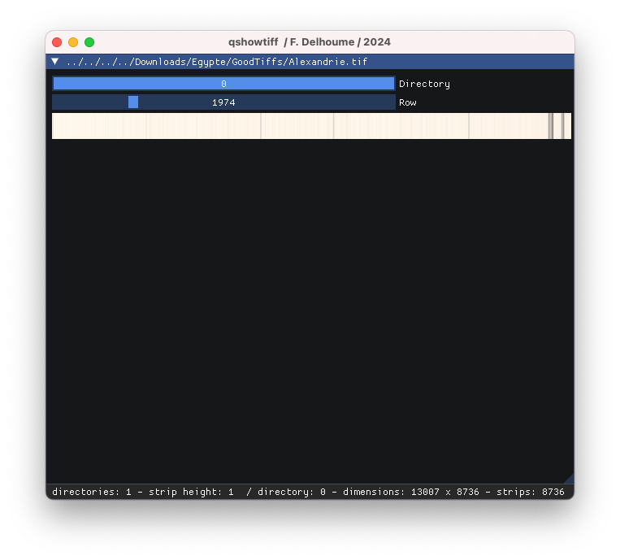
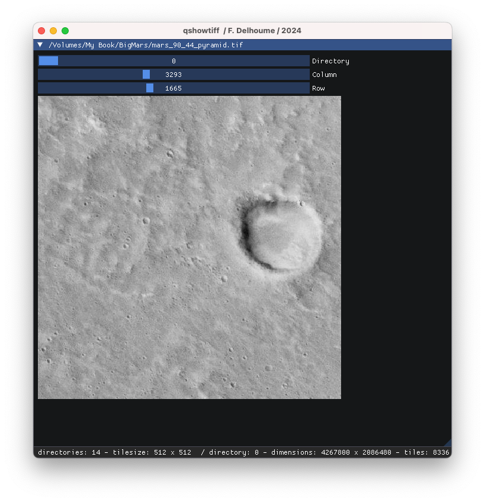

# qshowtiff
 Instantly preview any TIFF file, even very large ones.

Only display one tile or strip at once, with sliders to cover all possible range.
works better with multi-image TIFFs,all sub-images can be displayed 

Written as an exercise in imgui coding...

